# R/S experiment runs on an H100 cluster, started 2026-10-03

Snapshot of **2026-10-04 23:35 UTC**.  The runs are still going: this folder is regenerated from them
(`slurm/collect_outputs.sh`), so the numbers below change until every run is complete.

- **What runs:** the eight runnable experiments of [`experiments/`](../..), unchanged.  Rounds 1-4 of every run ran on commit `a742f6f` (#28), the same tree as `main` at `f1fd1f8`.  The graph runs were then extended to 8 rounds by commit `0874c76` (`run_iterative_experiment.py --extend-rounds`, branch `extend-rounds`, not yet merged), which keeps rounds 1-4 and continues from each arm's round-4 adapter; each run's `out/experiment.json` records the commit of every extension under `extensions`.  No other edit to any experiment's `config.json`, `evaluation.json` or `settings.sh`.  Qwen3-1.7B arithmetic is not run (S's target error almost never occurs, so round 1 is infeasible).
- **Machine:** one NVIDIA H100 80GB HBM3 per run (SLURM partition `h100_all`); torch 2.14.1+cu130, transformers 4.57.1, peft 0.17.1, Python 3.11.
- **How:** [`slurm/submit.sh`](slurm/submit.sh) runs `experiments/run.sh` in stages per pair: the unaudited experiment draws the 5 round-1 pools, then it and its audited sibling (reusing those pools) train, evaluate and draw their figures side by side; a job that ends abnormally is resumed once.  Job ids: [`slurm/jobs.txt`](slurm/jobs.txt).

## Progress

| experiment | model | round-1 K | rounds | arm-rounds trained | Pass@1 checkpoints evaluated (eval_id / eval_ood) | state | job (start → end) |
|---|---|---|---|---|---|---|---|
| [graph_unaudited](graph_unaudited/) | Qwen3-1.7B | 64 | 8 | 80 / 80 | 81 / 81 | complete | 10-03 02:40 → 10-04 17:13 |
| [graph_audited](graph_audited/) | Qwen3-1.7B | 64 | 8 | 80 / 80 | 81 / 81 | complete | 10-03 03:11 → 10-04 14:57 |
| [graph_unaudited_llama3.2-3b](graph_unaudited_llama3.2-3b/) | Llama-3.2-3B-Instruct | 64 | 8 | 80 / 80 | 81 / 81 | complete | 10-03 03:38 → 10-03 23:34 |
| [graph_audited_llama3.2-3b](graph_audited_llama3.2-3b/) | Llama-3.2-3B-Instruct | 64 | 8 | 80 / 80 | 81 / 81 | complete | 10-03 04:30 → 10-03 22:53 |
| [arithmetic_unaudited_llama3.2-3b](arithmetic_unaudited_llama3.2-3b/) | Llama-3.2-3B-Instruct | 64 | 4 | 26 / 40 | 0 / 0 | training, now b03/R/round_002 (sampled 8928/16384) | 10-03 08:54 → - |
| [arithmetic_audited_llama3.2-3b](arithmetic_audited_llama3.2-3b/) | Llama-3.2-3B-Instruct | 64 | 4 | 26 / 40 | 0 / 0 | training, now b03/R/round_002 (sampled 15808/16384) | 10-03 09:10 → - |
| [arithmetic_unaudited_llama3.2-1b](arithmetic_unaudited_llama3.2-1b/) | Llama-3.2-1B-Instruct | 64 | 4 | 27 / 40 | 0 / 0 | training, now b03/S/round_002 (sampled 1824/16384) | 10-03 10:43 → - |
| [arithmetic_audited_llama3.2-1b](arithmetic_audited_llama3.2-1b/) | Llama-3.2-1B-Instruct | 64 | 4 | 28 / 40 | 0 / 0 | training, now b03/R/round_003 (sampled 10400/16384) | 10-03 10:51 → - |

An arm-round is one arm (R or S) in one round of one seed block: 5 blocks x 2 arms x `rounds` (40 at 4 rounds, 80 at 8).  Every round after the first samples 2,048 prompts x 8 answers from the arm's own model, then trains on K of them.  Evaluation covers the base and every checkpoint (1 + 10 x `rounds`) on `eval_id` (2,000 questions) and `eval_ood` (1,000), greedy.  "job" is the run's first and last job, its extension included.

## Round 1: the shared pools (all 2,048 `train_001` prompts x 8 answers per seed block)

Matched R/S selection needs, per block, enough prompts with both a correct answer and an S-target error (J_E).  Measured on the real pools ([`reports/`](reports/)):

| task, model | correct | answers cut (loop or cap) per block | S-target errors per block | J_E per block at the config's setting | K | other settings |
|---|---|---|---|---|---|---|
| graph, Qwen3-1.7B | 50.5% | 27, 29, 33, 30, 29 | 2357, 2351, 2322, 2354, 2346 | 27, 38, 32, 31, 28 | 64 | C:E 0.25, tol null: K=64; C:E 0.125, tol null: K=64; C:E 0.125, tol 0: K=64 |
| graph, Llama-3.2-3B-Instruct | 23.4% | 147, 138, 121, 153, 132 | 2095, 2112, 2095, 2140, 2124 | 184, 180, 178, 188, 192 | 64 | C:E 0.25, tol null: K=64; C:E 0.125, tol null: K=64; C:E 0.125, tol 0: K=64 |
| arithmetic, Llama-3.2-3B-Instruct | 74.7% | 0, 0, 2, 0, 2 | 74, 81, 71, 74, 87 | 30, 32, 17, 28, 33 | 64 | C:E 0.25, tol 0: infeasible; C:E 0.125, tol null: K=64; C:E 0.125, tol 0: infeasible |
| arithmetic, Llama-3.2-1B-Instruct | 42.1% | 100, 111, 84, 90, 87 | 69, 69, 63, 75, 70 | 54, 45, 43, 55, 48 | 64 | C:E 0.25, tol 0: infeasible; C:E 0.125, tol null: K=64; C:E 0.125, tol 0: infeasible |

C:E 0.25 = 3:1 (48 correct + 16 wrong at K = 64); tol = `matching.token_tolerance` (graph 0, arithmetic null = no limit).

## Results

### graph_unaudited: graph, Qwen3-1.7B (T 1.3)

**eval_id**, greedy Pass@1 and the S-target error rate by round, mean over the 5 seed blocks ± 95% half width (t=0 is the base):

| pass1 | t=0 | t=1 | t=2 | t=3 | t=4 | t=5 | t=6 | t=7 | t=8 |
|---|---|---|---|---|---|---|---|---|---|
| R | 0.499 ± 0.000 | 0.517 ± 0.017 | 0.529 ± 0.029 | 0.536 ± 0.040 | 0.556 ± 0.043 | 0.564 ± 0.030 | 0.580 ± 0.030 | 0.597 ± 0.032 | 0.606 ± 0.038 |
| S | 0.499 ± 0.000 | 0.527 ± 0.019 | 0.532 ± 0.037 | 0.541 ± 0.055 | 0.553 ± 0.040 | 0.577 ± 0.064 | 0.573 ± 0.079 | 0.632 ± 0.049 | 0.646 ± 0.030 |
| S-R | 0.000 ± 0.000 | 0.010 ± 0.012 (p=0.08) | 0.003 ± 0.035 (p=0.82) | 0.005 ± 0.039 (p=0.76) | -0.003 ± 0.044 (p=0.88) | 0.013 ± 0.043 (p=0.46) | -0.007 ± 0.083 (p=0.83) | 0.034 ± 0.052 (p=0.14) | 0.040 ± 0.045 (p=0.07) |

| target_error_rate | t=0 | t=1 | t=2 | t=3 | t=4 | t=5 | t=6 | t=7 | t=8 |
|---|---|---|---|---|---|---|---|---|---|
| R | 0.135 ± 0.000 | 0.132 ± 0.029 | 0.126 ± 0.045 | 0.121 ± 0.031 | 0.103 ± 0.029 | 0.105 ± 0.059 | 0.077 ± 0.049 | 0.067 ± 0.046 | 0.049 ± 0.036 |
| S | 0.135 ± 0.000 | 0.129 ± 0.024 | 0.143 ± 0.038 | 0.168 ± 0.032 | 0.171 ± 0.037 | 0.148 ± 0.047 | 0.162 ± 0.061 | 0.132 ± 0.027 | 0.151 ± 0.038 |
| S-R | 0.000 ± 0.000 | -0.003 ± 0.012 (p=0.59) | 0.017 ± 0.043 (p=0.33) | 0.046 ± 0.022 (p=0.00) | 0.068 ± 0.039 (p=0.01) | 0.043 ± 0.075 (p=0.19) | 0.086 ± 0.081 (p=0.04) | 0.065 ± 0.057 (p=0.03) | 0.102 ± 0.033 (p=0.00) |

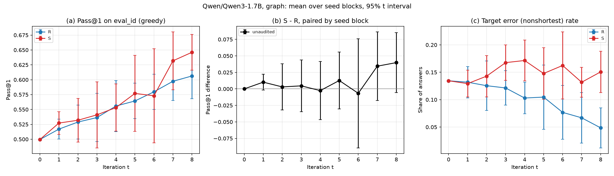

**eval_ood**, greedy Pass@1 and the S-target error rate by round, mean over the 5 seed blocks ± 95% half width (t=0 is the base):

| pass1 | t=0 | t=1 | t=2 | t=3 | t=4 | t=5 | t=6 | t=7 | t=8 |
|---|---|---|---|---|---|---|---|---|---|
| R | 0.347 ± 0.000 | 0.352 ± 0.011 | 0.349 ± 0.026 | 0.362 ± 0.022 | 0.363 ± 0.026 | 0.362 ± 0.016 | 0.363 ± 0.032 | 0.377 ± 0.019 | 0.385 ± 0.039 |
| S | 0.347 ± 0.000 | 0.366 ± 0.015 | 0.369 ± 0.016 | 0.385 ± 0.034 | 0.389 ± 0.025 | 0.391 ± 0.032 | 0.386 ± 0.051 | 0.422 ± 0.042 | 0.432 ± 0.015 |
| S-R | 0.000 ± 0.000 | 0.014 ± 0.021 (p=0.14) | 0.020 ± 0.020 (p=0.05) | 0.023 ± 0.022 (p=0.04) | 0.026 ± 0.038 (p=0.13) | 0.029 ± 0.030 (p=0.05) | 0.023 ± 0.063 (p=0.37) | 0.045 ± 0.045 (p=0.05) | 0.047 ± 0.042 (p=0.04) |

| target_error_rate | t=0 | t=1 | t=2 | t=3 | t=4 | t=5 | t=6 | t=7 | t=8 |
|---|---|---|---|---|---|---|---|---|---|
| R | 0.060 ± 0.000 | 0.075 ± 0.025 | 0.071 ± 0.032 | 0.068 ± 0.016 | 0.057 ± 0.017 | 0.073 ± 0.040 | 0.057 ± 0.034 | 0.050 ± 0.021 | 0.042 ± 0.035 |
| S | 0.060 ± 0.000 | 0.065 ± 0.021 | 0.088 ± 0.029 | 0.108 ± 0.025 | 0.124 ± 0.032 | 0.109 ± 0.025 | 0.124 ± 0.030 | 0.114 ± 0.034 | 0.145 ± 0.060 |
| S-R | 0.000 ± 0.000 | -0.009 ± 0.007 (p=0.02) | 0.017 ± 0.026 (p=0.14) | 0.040 ± 0.015 (p=0.00) | 0.066 ± 0.038 (p=0.01) | 0.036 ± 0.052 (p=0.13) | 0.067 ± 0.050 (p=0.02) | 0.064 ± 0.034 (p=0.01) | 0.103 ± 0.030 (p=0.00) |

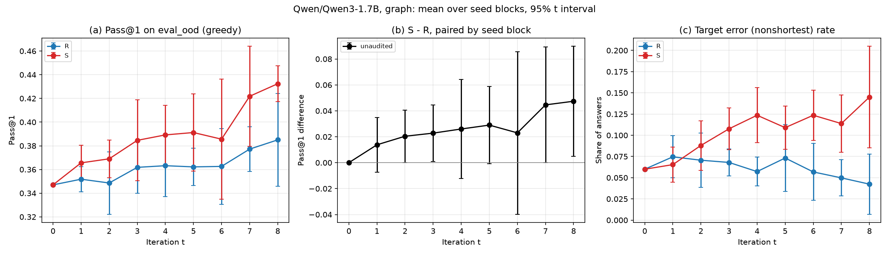

### graph_audited: graph, Qwen3-1.7B (T 1.3)

**eval_id**, greedy Pass@1 and the S-target error rate by round, mean over the 5 seed blocks ± 95% half width (t=0 is the base):

| pass1 | t=0 | t=1 | t=2 | t=3 | t=4 | t=5 | t=6 | t=7 | t=8 |
|---|---|---|---|---|---|---|---|---|---|
| R | 0.499 ± 0.000 | 0.513 ± 0.027 | 0.530 ± 0.021 | 0.526 ± 0.039 | 0.533 ± 0.051 | 0.551 ± 0.045 | 0.548 ± 0.037 | 0.541 ± 0.054 | 0.589 ± 0.038 |
| S | 0.499 ± 0.000 | 0.509 ± 0.024 | 0.532 ± 0.012 | 0.561 ± 0.045 | 0.551 ± 0.062 | 0.569 ± 0.038 | 0.594 ± 0.045 | 0.638 ± 0.044 | 0.618 ± 0.108 |
| S-R | 0.000 ± 0.000 | -0.003 ± 0.017 (p=0.61) | 0.003 ± 0.015 (p=0.64) | 0.036 ± 0.056 (p=0.15) | 0.017 ± 0.093 (p=0.63) | 0.018 ± 0.074 (p=0.54) | 0.046 ± 0.018 (p=0.00) | 0.097 ± 0.043 (p=0.00) | 0.029 ± 0.091 (p=0.43) |

| target_error_rate | t=0 | t=1 | t=2 | t=3 | t=4 | t=5 | t=6 | t=7 | t=8 |
|---|---|---|---|---|---|---|---|---|---|
| R | 0.135 ± 0.000 | 0.138 ± 0.016 | 0.132 ± 0.014 | 0.136 ± 0.053 | 0.129 ± 0.064 | 0.118 ± 0.057 | 0.133 ± 0.034 | 0.141 ± 0.031 | 0.105 ± 0.050 |
| S | 0.135 ± 0.000 | 0.139 ± 0.022 | 0.140 ± 0.022 | 0.139 ± 0.049 | 0.158 ± 0.034 | 0.187 ± 0.027 | 0.153 ± 0.047 | 0.115 ± 0.028 | 0.140 ± 0.084 |
| S-R | 0.000 ± 0.000 | 0.002 ± 0.009 (p=0.64) | 0.008 ± 0.020 (p=0.31) | 0.003 ± 0.073 (p=0.91) | 0.029 ± 0.074 (p=0.34) | 0.069 ± 0.077 (p=0.07) | 0.020 ± 0.065 (p=0.44) | -0.026 ± 0.053 (p=0.25) | 0.035 ± 0.071 (p=0.24) |

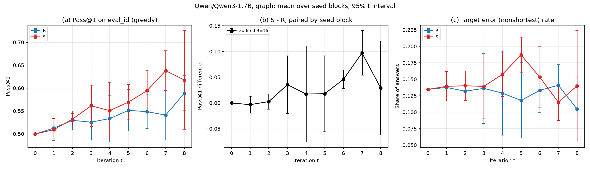

**eval_ood**, greedy Pass@1 and the S-target error rate by round, mean over the 5 seed blocks ± 95% half width (t=0 is the base):

| pass1 | t=0 | t=1 | t=2 | t=3 | t=4 | t=5 | t=6 | t=7 | t=8 |
|---|---|---|---|---|---|---|---|---|---|
| R | 0.347 ± 0.000 | 0.360 ± 0.023 | 0.368 ± 0.011 | 0.362 ± 0.016 | 0.362 ± 0.028 | 0.366 ± 0.022 | 0.379 ± 0.031 | 0.362 ± 0.043 | 0.388 ± 0.018 |
| S | 0.347 ± 0.000 | 0.354 ± 0.017 | 0.375 ± 0.013 | 0.385 ± 0.035 | 0.386 ± 0.037 | 0.398 ± 0.031 | 0.401 ± 0.033 | 0.430 ± 0.048 | 0.424 ± 0.076 |
| S-R | 0.000 ± 0.000 | -0.006 ± 0.016 (p=0.33) | 0.007 ± 0.015 (p=0.26) | 0.023 ± 0.031 (p=0.11) | 0.024 ± 0.038 (p=0.16) | 0.033 ± 0.038 (p=0.07) | 0.022 ± 0.035 (p=0.16) | 0.068 ± 0.014 (p=0.00) | 0.037 ± 0.063 (p=0.18) |

| target_error_rate | t=0 | t=1 | t=2 | t=3 | t=4 | t=5 | t=6 | t=7 | t=8 |
|---|---|---|---|---|---|---|---|---|---|
| R | 0.060 ± 0.000 | 0.074 ± 0.017 | 0.069 ± 0.009 | 0.075 ± 0.028 | 0.073 ± 0.032 | 0.071 ± 0.040 | 0.078 ± 0.024 | 0.085 ± 0.024 | 0.071 ± 0.028 |
| S | 0.060 ± 0.000 | 0.071 ± 0.015 | 0.081 ± 0.024 | 0.085 ± 0.032 | 0.102 ± 0.020 | 0.141 ± 0.008 | 0.120 ± 0.047 | 0.108 ± 0.026 | 0.127 ± 0.051 |
| S-R | 0.000 ± 0.000 | -0.002 ± 0.010 (p=0.53) | 0.012 ± 0.026 (p=0.27) | 0.010 ± 0.044 (p=0.58) | 0.029 ± 0.043 (p=0.13) | 0.069 ± 0.034 (p=0.00) | 0.042 ± 0.060 (p=0.13) | 0.022 ± 0.045 (p=0.24) | 0.056 ± 0.055 (p=0.05) |

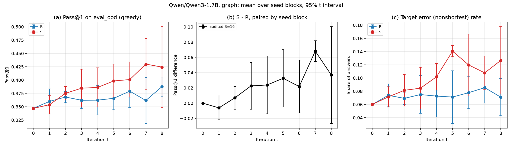

**graph_unaudited vs graph_audited, eval_id** (both arms of both runs; [`figures/`](figures/)):

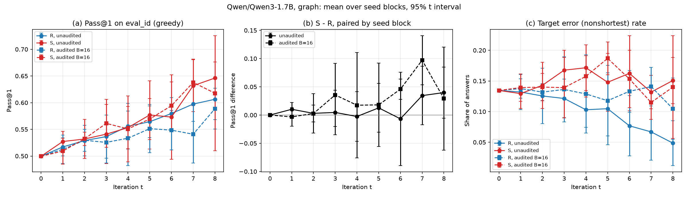

**graph_unaudited vs graph_audited, eval_ood** (both arms of both runs; [`figures/`](figures/)):

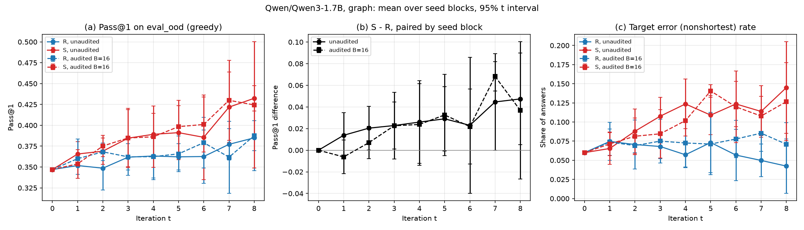

### graph_unaudited_llama3.2-3b: graph, Llama-3.2-3B-Instruct (T 0.6, top-p 0.9)

**eval_id**, greedy Pass@1 and the S-target error rate by round, mean over the 5 seed blocks ± 95% half width (t=0 is the base):

| pass1 | t=0 | t=1 | t=2 | t=3 | t=4 | t=5 | t=6 | t=7 | t=8 |
|---|---|---|---|---|---|---|---|---|---|
| R | 0.248 ± 0.000 | 0.471 ± 0.039 | 0.499 ± 0.049 | 0.509 ± 0.091 | 0.558 ± 0.081 | 0.630 ± 0.056 | 0.645 ± 0.038 | 0.662 ± 0.042 | 0.640 ± 0.062 |
| S | 0.248 ± 0.000 | 0.482 ± 0.038 | 0.532 ± 0.056 | 0.544 ± 0.057 | 0.560 ± 0.068 | 0.587 ± 0.106 | 0.603 ± 0.116 | 0.586 ± 0.136 | 0.611 ± 0.102 |
| S-R | 0.000 ± 0.000 | 0.011 ± 0.020 (p=0.20) | 0.033 ± 0.099 (p=0.40) | 0.034 ± 0.100 (p=0.40) | 0.002 ± 0.105 (p=0.96) | -0.042 ± 0.110 (p=0.35) | -0.042 ± 0.120 (p=0.39) | -0.077 ± 0.140 (p=0.20) | -0.029 ± 0.111 (p=0.51) |

| target_error_rate | t=0 | t=1 | t=2 | t=3 | t=4 | t=5 | t=6 | t=7 | t=8 |
|---|---|---|---|---|---|---|---|---|---|
| R | 0.127 ± 0.000 | 0.152 ± 0.013 | 0.150 ± 0.023 | 0.152 ± 0.020 | 0.147 ± 0.041 | 0.104 ± 0.032 | 0.105 ± 0.052 | 0.077 ± 0.032 | 0.099 ± 0.062 |
| S | 0.127 ± 0.000 | 0.170 ± 0.018 | 0.176 ± 0.050 | 0.192 ± 0.055 | 0.183 ± 0.069 | 0.185 ± 0.075 | 0.216 ± 0.074 | 0.253 ± 0.111 | 0.215 ± 0.120 |
| S-R | 0.000 ± 0.000 | 0.018 ± 0.017 (p=0.04) | 0.026 ± 0.064 (p=0.32) | 0.040 ± 0.067 (p=0.18) | 0.036 ± 0.103 (p=0.39) | 0.081 ± 0.104 (p=0.10) | 0.110 ± 0.118 (p=0.06) | 0.177 ± 0.140 (p=0.02) | 0.116 ± 0.172 (p=0.13) |

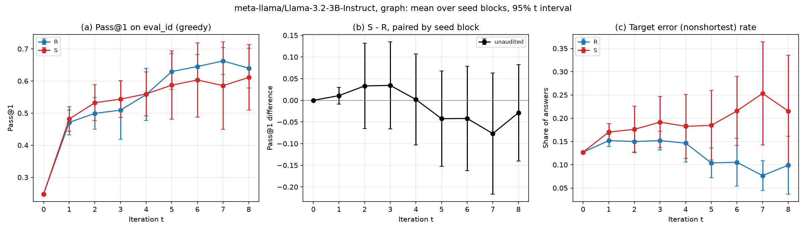

**eval_ood**, greedy Pass@1 and the S-target error rate by round, mean over the 5 seed blocks ± 95% half width (t=0 is the base):

| pass1 | t=0 | t=1 | t=2 | t=3 | t=4 | t=5 | t=6 | t=7 | t=8 |
|---|---|---|---|---|---|---|---|---|---|
| R | 0.209 ± 0.000 | 0.372 ± 0.028 | 0.378 ± 0.037 | 0.399 ± 0.064 | 0.430 ± 0.070 | 0.466 ± 0.029 | 0.467 ± 0.041 | 0.472 ± 0.027 | 0.454 ± 0.048 |
| S | 0.209 ± 0.000 | 0.390 ± 0.024 | 0.424 ± 0.042 | 0.435 ± 0.046 | 0.447 ± 0.054 | 0.458 ± 0.075 | 0.472 ± 0.077 | 0.463 ± 0.099 | 0.478 ± 0.070 |
| S-R | 0.000 ± 0.000 | 0.018 ± 0.019 (p=0.06) | 0.045 ± 0.059 (p=0.10) | 0.037 ± 0.070 (p=0.22) | 0.017 ± 0.081 (p=0.59) | -0.008 ± 0.064 (p=0.74) | 0.005 ± 0.085 (p=0.87) | -0.009 ± 0.088 (p=0.79) | 0.024 ± 0.064 (p=0.35) |

| target_error_rate | t=0 | t=1 | t=2 | t=3 | t=4 | t=5 | t=6 | t=7 | t=8 |
|---|---|---|---|---|---|---|---|---|---|
| R | 0.073 ± 0.000 | 0.070 ± 0.009 | 0.077 ± 0.018 | 0.079 ± 0.008 | 0.090 ± 0.040 | 0.073 ± 0.028 | 0.075 ± 0.039 | 0.049 ± 0.010 | 0.069 ± 0.046 |
| S | 0.073 ± 0.000 | 0.082 ± 0.010 | 0.102 ± 0.048 | 0.126 ± 0.051 | 0.118 ± 0.061 | 0.134 ± 0.036 | 0.183 ± 0.028 | 0.235 ± 0.053 | 0.206 ± 0.108 |
| S-R | 0.000 ± 0.000 | 0.012 ± 0.012 (p=0.05) | 0.025 ± 0.061 (p=0.31) | 0.047 ± 0.054 (p=0.07) | 0.029 ± 0.084 (p=0.40) | 0.061 ± 0.054 (p=0.03) | 0.107 ± 0.033 (p=0.00) | 0.186 ± 0.056 (p=0.00) | 0.137 ± 0.144 (p=0.06) |

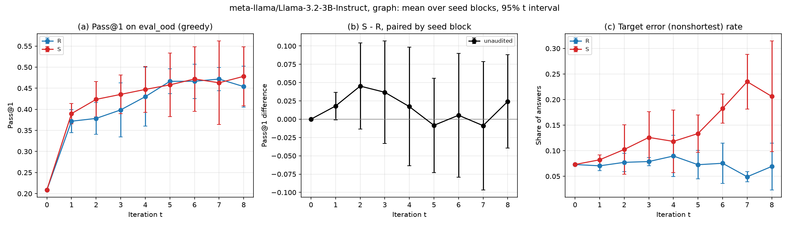

### graph_audited_llama3.2-3b: graph, Llama-3.2-3B-Instruct (T 0.6, top-p 0.9)

**eval_id**, greedy Pass@1 and the S-target error rate by round, mean over the 5 seed blocks ± 95% half width (t=0 is the base):

| pass1 | t=0 | t=1 | t=2 | t=3 | t=4 | t=5 | t=6 | t=7 | t=8 |
|---|---|---|---|---|---|---|---|---|---|
| R | 0.248 ± 0.000 | 0.452 ± 0.023 | 0.506 ± 0.020 | 0.548 ± 0.050 | 0.586 ± 0.073 | 0.585 ± 0.080 | 0.626 ± 0.027 | 0.626 ± 0.045 | 0.651 ± 0.075 |
| S | 0.248 ± 0.000 | 0.447 ± 0.011 | 0.531 ± 0.066 | 0.585 ± 0.044 | 0.620 ± 0.031 | 0.634 ± 0.061 | 0.655 ± 0.046 | 0.669 ± 0.073 | 0.620 ± 0.070 |
| S-R | 0.000 ± 0.000 | -0.006 ± 0.015 (p=0.34) | 0.025 ± 0.058 (p=0.29) | 0.036 ± 0.033 (p=0.04) | 0.034 ± 0.067 (p=0.24) | 0.049 ± 0.097 (p=0.23) | 0.030 ± 0.060 (p=0.24) | 0.043 ± 0.065 (p=0.14) | -0.031 ± 0.086 (p=0.38) |

| target_error_rate | t=0 | t=1 | t=2 | t=3 | t=4 | t=5 | t=6 | t=7 | t=8 |
|---|---|---|---|---|---|---|---|---|---|
| R | 0.127 ± 0.000 | 0.175 ± 0.039 | 0.147 ± 0.024 | 0.155 ± 0.055 | 0.129 ± 0.049 | 0.113 ± 0.088 | 0.083 ± 0.070 | 0.063 ± 0.056 | 0.061 ± 0.043 |
| S | 0.127 ± 0.000 | 0.193 ± 0.046 | 0.152 ± 0.063 | 0.136 ± 0.063 | 0.137 ± 0.068 | 0.133 ± 0.095 | 0.144 ± 0.047 | 0.155 ± 0.066 | 0.222 ± 0.083 |
| S-R | 0.000 ± 0.000 | 0.018 ± 0.021 (p=0.08) | 0.005 ± 0.054 (p=0.79) | -0.019 ± 0.063 (p=0.46) | 0.007 ± 0.063 (p=0.76) | 0.021 ± 0.082 (p=0.52) | 0.061 ± 0.078 (p=0.09) | 0.092 ± 0.113 (p=0.09) | 0.161 ± 0.101 (p=0.01) |

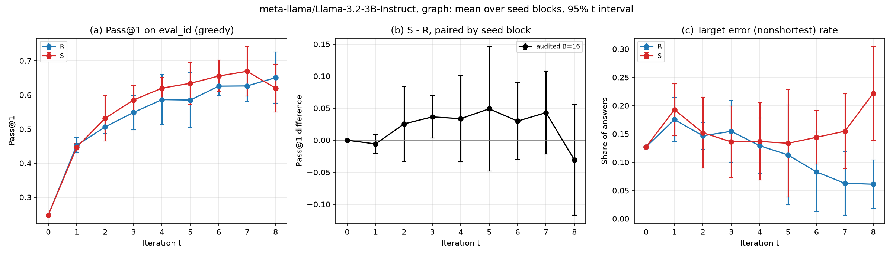

**eval_ood**, greedy Pass@1 and the S-target error rate by round, mean over the 5 seed blocks ± 95% half width (t=0 is the base):

| pass1 | t=0 | t=1 | t=2 | t=3 | t=4 | t=5 | t=6 | t=7 | t=8 |
|---|---|---|---|---|---|---|---|---|---|
| R | 0.209 ± 0.000 | 0.366 ± 0.019 | 0.396 ± 0.016 | 0.437 ± 0.037 | 0.449 ± 0.032 | 0.429 ± 0.036 | 0.454 ± 0.052 | 0.435 ± 0.050 | 0.459 ± 0.087 |
| S | 0.209 ± 0.000 | 0.370 ± 0.011 | 0.411 ± 0.027 | 0.445 ± 0.025 | 0.476 ± 0.037 | 0.479 ± 0.051 | 0.488 ± 0.046 | 0.500 ± 0.049 | 0.474 ± 0.024 |
| S-R | 0.000 ± 0.000 | 0.004 ± 0.009 (p=0.31) | 0.015 ± 0.023 (p=0.15) | 0.008 ± 0.048 (p=0.66) | 0.027 ± 0.044 (p=0.16) | 0.050 ± 0.067 (p=0.11) | 0.034 ± 0.072 (p=0.25) | 0.065 ± 0.033 (p=0.01) | 0.015 ± 0.081 (p=0.64) |

| target_error_rate | t=0 | t=1 | t=2 | t=3 | t=4 | t=5 | t=6 | t=7 | t=8 |
|---|---|---|---|---|---|---|---|---|---|
| R | 0.073 ± 0.000 | 0.083 ± 0.033 | 0.072 ± 0.022 | 0.091 ± 0.058 | 0.074 ± 0.044 | 0.075 ± 0.075 | 0.059 ± 0.065 | 0.042 ± 0.048 | 0.049 ± 0.037 |
| S | 0.073 ± 0.000 | 0.095 ± 0.046 | 0.086 ± 0.048 | 0.101 ± 0.062 | 0.120 ± 0.085 | 0.113 ± 0.099 | 0.122 ± 0.052 | 0.130 ± 0.050 | 0.189 ± 0.104 |
| S-R | 0.000 ± 0.000 | 0.011 ± 0.021 (p=0.21) | 0.014 ± 0.027 (p=0.22) | 0.010 ± 0.047 (p=0.58) | 0.046 ± 0.091 (p=0.23) | 0.039 ± 0.050 (p=0.10) | 0.063 ± 0.060 (p=0.04) | 0.089 ± 0.091 (p=0.05) | 0.139 ± 0.123 (p=0.03) |

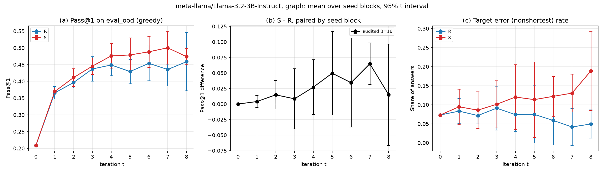

**graph_unaudited_llama3.2-3b vs graph_audited_llama3.2-3b, eval_id** (both arms of both runs; [`figures/`](figures/)):

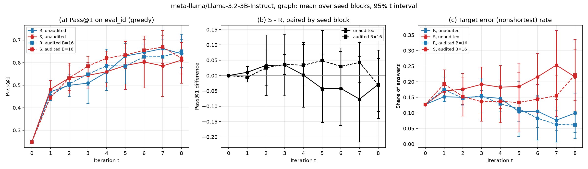

**graph_unaudited_llama3.2-3b vs graph_audited_llama3.2-3b, eval_ood** (both arms of both runs; [`figures/`](figures/)):

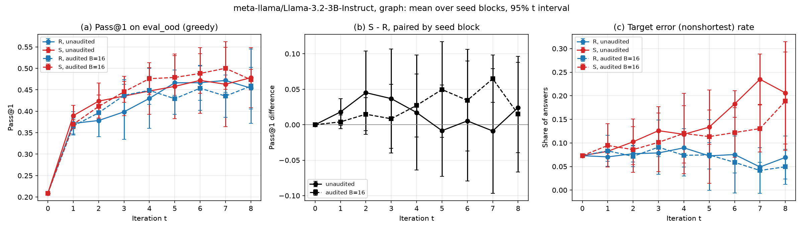

## Rounds 0-4 of the graph runs (the 4-round view)

The graph runs ran 8 rounds. Their rounds 1-4 are those of the 4-round runs, unchanged: the extension keeps them.
- **How these figures are drawn.** The runs' own `plot_multiround.py` draws them from the same evaluation records, restricted to rounds 0-4 (`slurm/plot_rounds0-4.sh`). So they are the 4-round results, comparable with 4-round runs elsewhere.
- **Check.** For the Llama-3.2-3B pair, their tables are byte-identical to those of its 4-round figures drawn on 2026-10-03.
- **Every round.** The tables in Results above give rounds 0-8; their first five columns are these rounds.

At round 4 (mean over the 5 seed blocks; S - R with its 95% half width and paired-t p):

| experiment | split | Pass@1 R / S | Pass@1 S - R | target-error rate R / S | target-error S - R |
|---|---|---|---|---|---|
| graph_unaudited | eval_id | 0.556 / 0.553 | -0.003 ± 0.044 (p=0.88) | 0.103 / 0.171 | 0.068 ± 0.039 (p=0.01) |
| graph_unaudited | eval_ood | 0.363 / 0.389 | 0.026 ± 0.038 (p=0.13) | 0.057 / 0.124 | 0.066 ± 0.038 (p=0.01) |
| graph_audited | eval_id | 0.533 / 0.551 | 0.017 ± 0.093 (p=0.63) | 0.129 / 0.158 | 0.029 ± 0.074 (p=0.34) |
| graph_audited | eval_ood | 0.362 / 0.386 | 0.024 ± 0.038 (p=0.16) | 0.073 / 0.102 | 0.029 ± 0.043 (p=0.13) |
| graph_unaudited_llama3.2-3b | eval_id | 0.558 / 0.560 | 0.002 ± 0.105 (p=0.96) | 0.147 / 0.183 | 0.036 ± 0.103 (p=0.39) |
| graph_unaudited_llama3.2-3b | eval_ood | 0.430 / 0.447 | 0.017 ± 0.081 (p=0.59) | 0.090 / 0.118 | 0.029 ± 0.084 (p=0.40) |
| graph_audited_llama3.2-3b | eval_id | 0.586 / 0.620 | 0.034 ± 0.067 (p=0.24) | 0.129 / 0.137 | 0.007 ± 0.063 (p=0.76) |
| graph_audited_llama3.2-3b | eval_ood | 0.449 / 0.476 | 0.027 ± 0.044 (p=0.16) | 0.074 / 0.120 | 0.046 ± 0.091 (p=0.23) |

**graph_unaudited vs graph_audited, eval_id, rounds 0-4:**

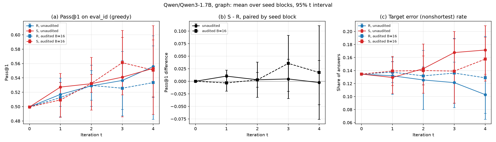

**graph_unaudited vs graph_audited, eval_ood, rounds 0-4:**

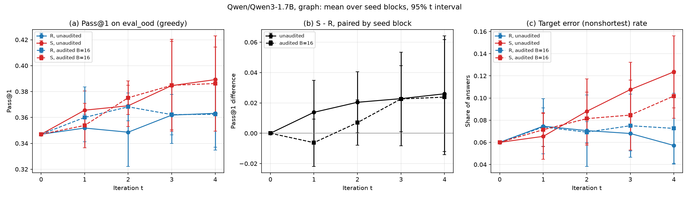

Each experiment alone: [`graph_unaudited eval_id`](graph_unaudited/figures/graph_unaudited_rounds0-4_eval_id_pass1.png), [`graph_unaudited eval_ood`](graph_unaudited/figures/graph_unaudited_rounds0-4_eval_ood_pass1.png), [`graph_audited eval_id`](graph_audited/figures/graph_audited_rounds0-4_eval_id_pass1.png), [`graph_audited eval_ood`](graph_audited/figures/graph_audited_rounds0-4_eval_ood_pass1.png).

**graph_unaudited_llama3.2-3b vs graph_audited_llama3.2-3b, eval_id, rounds 0-4:**

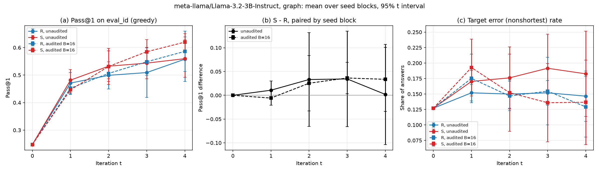

**graph_unaudited_llama3.2-3b vs graph_audited_llama3.2-3b, eval_ood, rounds 0-4:**

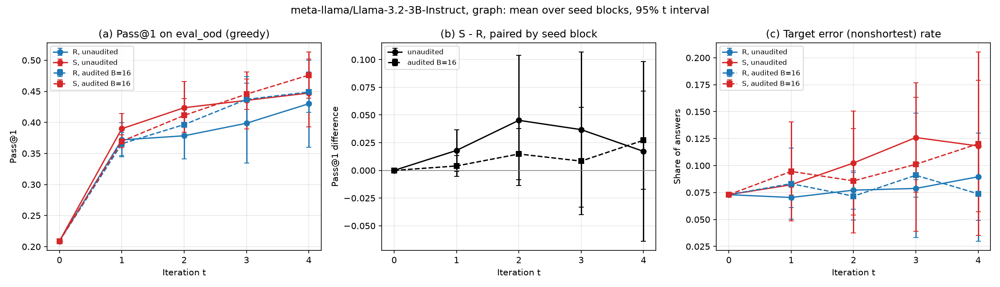

Each experiment alone: [`graph_unaudited_llama3.2-3b eval_id`](graph_unaudited_llama3.2-3b/figures/graph_unaudited_llama3.2-3b_rounds0-4_eval_id_pass1.png), [`graph_unaudited_llama3.2-3b eval_ood`](graph_unaudited_llama3.2-3b/figures/graph_unaudited_llama3.2-3b_rounds0-4_eval_ood_pass1.png), [`graph_audited_llama3.2-3b eval_id`](graph_audited_llama3.2-3b/figures/graph_audited_llama3.2-3b_rounds0-4_eval_id_pass1.png), [`graph_audited_llama3.2-3b eval_ood`](graph_audited_llama3.2-3b/figures/graph_audited_llama3.2-3b_rounds0-4_eval_ood_pass1.png).

## Training dynamics: h^T Δθ by round

Per round, the mean over the seed blocks finished so far of each arm's projection of that round's Δθ on h (the reference gradient at the shared initialisation), |Δθ| and the training loss (`out/<block>/<arm>/round_00t/complete.json`).

**graph_unaudited**

| round | R: h^T Δθ | S: h^T Δθ | R: \|Δθ\| | S: \|Δθ\| | R: loss | S: loss | blocks (R/S) |
|---|---|---|---|---|---|---|---|
| 1 | -0.0668 | -0.0654 | 1.1172 | 1.0907 | 0.0540 | 0.0531 | 5/5 |
| 2 | -0.0298 | -0.0286 | 1.0837 | 1.0971 | 0.0455 | 0.0484 | 5/5 |
| 3 | -0.0428 | -0.0365 | 1.1360 | 1.1251 | 0.0511 | 0.0473 | 5/5 |
| 4 | -0.0309 | -0.0158 | 1.0900 | 1.0698 | 0.0498 | 0.0420 | 5/5 |
| 5 | -0.0302 | -0.0350 | 1.1141 | 1.1029 | 0.0599 | 0.0461 | 5/5 |
| 6 | -0.0530 | -0.0136 | 1.0917 | 1.1294 | 0.0692 | 0.0586 | 5/5 |
| 7 | -0.0134 | -0.0398 | 1.0750 | 1.1190 | 0.1074 | 0.0604 | 5/5 |
| 8 | -0.0137 | -0.0248 | 1.1069 | 1.1010 | 0.1495 | 0.0650 | 5/5 |

**graph_audited**

| round | R: h^T Δθ | S: h^T Δθ | R: \|Δθ\| | S: \|Δθ\| | R: loss | S: loss | blocks (R/S) |
|---|---|---|---|---|---|---|---|
| 1 | -0.0625 | -0.0535 | 0.9688 | 0.9804 | 0.0569 | 0.0543 | 5/5 |
| 2 | -0.0179 | -0.0024 | 0.8276 | 1.0296 | 0.0409 | 0.0517 | 5/5 |
| 3 | -0.0070 | -0.0391 | 0.9308 | 1.0214 | 0.0409 | 0.0592 | 5/5 |
| 4 | -0.0108 | -0.0115 | 0.9430 | 1.0097 | 0.0326 | 0.0387 | 5/5 |
| 5 | -0.0203 | -0.0416 | 1.0762 | 1.0930 | 0.0399 | 0.0477 | 5/5 |
| 6 | -0.0227 | -0.0287 | 1.0238 | 1.0588 | 0.0494 | 0.0584 | 5/5 |
| 7 | -0.0266 | -0.0324 | 1.1294 | 0.9675 | 0.0514 | 0.0446 | 5/5 |
| 8 | -0.0292 | -0.0083 | 1.0193 | 0.9860 | 0.0564 | 0.0527 | 5/5 |

**graph_unaudited_llama3.2-3b**

| round | R: h^T Δθ | S: h^T Δθ | R: \|Δθ\| | S: \|Δθ\| | R: loss | S: loss | blocks (R/S) |
|---|---|---|---|---|---|---|---|
| 1 | -0.2327 | -0.2600 | 1.3530 | 1.4406 | 0.0934 | 0.0804 | 5/5 |
| 2 | -0.0257 | -0.0439 | 1.2891 | 1.3408 | 0.0617 | 0.0434 | 5/5 |
| 3 | -0.0202 | -0.0026 | 1.3309 | 1.3213 | 0.0578 | 0.0508 | 5/5 |
| 4 | -0.0263 | -0.0186 | 1.3236 | 1.3339 | 0.0545 | 0.0523 | 5/5 |
| 5 | -0.0234 | -0.0139 | 1.3476 | 1.3512 | 0.0590 | 0.0568 | 5/5 |
| 6 | -0.0168 | -0.0018 | 1.3090 | 1.3345 | 0.0708 | 0.0476 | 5/5 |
| 7 | -0.0178 | -0.0159 | 1.3298 | 1.3256 | 0.0670 | 0.0569 | 5/5 |
| 8 | 0.0064 | -0.0129 | 1.2991 | 1.3390 | 0.0645 | 0.0515 | 5/5 |

**graph_audited_llama3.2-3b**

| round | R: h^T Δθ | S: h^T Δθ | R: \|Δθ\| | S: \|Δθ\| | R: loss | S: loss | blocks (R/S) |
|---|---|---|---|---|---|---|---|
| 1 | -0.2486 | -0.2620 | 1.2636 | 1.3206 | 0.0820 | 0.0760 | 5/5 |
| 2 | -0.0562 | -0.0382 | 1.1537 | 1.2029 | 0.0628 | 0.0408 | 5/5 |
| 3 | -0.0069 | -0.0473 | 1.2078 | 1.2751 | 0.0550 | 0.0503 | 5/5 |
| 4 | -0.0201 | -0.0288 | 1.2563 | 1.2340 | 0.0466 | 0.0600 | 5/5 |
| 5 | -0.0077 | -0.0135 | 1.3011 | 1.2411 | 0.0584 | 0.0523 | 5/5 |
| 6 | -0.0308 | -0.0195 | 1.1891 | 1.2178 | 0.0411 | 0.0476 | 5/5 |
| 7 | -0.0079 | -0.0007 | 1.1765 | 1.2254 | 0.0376 | 0.0530 | 5/5 |
| 8 | -0.0171 | -0.0041 | 1.2746 | 1.2899 | 0.0545 | 0.0331 | 5/5 |

**arithmetic_unaudited_llama3.2-3b**

| round | R: h^T Δθ | S: h^T Δθ | R: \|Δθ\| | S: \|Δθ\| | R: loss | S: loss | blocks (R/S) |
|---|---|---|---|---|---|---|---|
| 1 | 0.8842 | 0.8809 | 1.2714 | 1.2668 | 0.0922 | 0.0924 | 4/4 |
| 2 | 0.2151 | 0.1615 | 1.1720 | 1.2202 | 0.0519 | 0.0515 | 3/3 |
| 3 | 0.0734 | 0.0338 | 1.1882 | 1.1677 | 0.0404 | 0.0435 | 3/3 |
| 4 | 0.0422 | -0.0154 | 1.1657 | 1.2028 | 0.0348 | 0.0349 | 3/3 |

**arithmetic_audited_llama3.2-3b**

| round | R: h^T Δθ | S: h^T Δθ | R: \|Δθ\| | S: \|Δθ\| | R: loss | S: loss | blocks (R/S) |
|---|---|---|---|---|---|---|---|
| 1 | 0.7998 | 0.8305 | 1.1757 | 1.1855 | 0.0948 | 0.0929 | 4/4 |
| 2 | 0.1776 | 0.1037 | 1.0686 | 0.9737 | 0.0554 | 0.0565 | 3/3 |
| 3 | -0.0006 | 0.0164 | 1.0410 | 1.0516 | 0.0390 | 0.0445 | 3/3 |
| 4 | 0.0276 | 0.0342 | 1.1571 | 1.1975 | 0.0307 | 0.0394 | 3/3 |

**arithmetic_unaudited_llama3.2-1b**

| round | R: h^T Δθ | S: h^T Δθ | R: \|Δθ\| | S: \|Δθ\| | R: loss | S: loss | blocks (R/S) |
|---|---|---|---|---|---|---|---|
| 1 | 1.5249 | 1.5640 | 0.9380 | 0.9435 | 0.1475 | 0.1431 | 4/4 |
| 2 | 0.1534 | 0.1866 | 0.7316 | 0.7061 | 0.0799 | 0.0763 | 4/3 |
| 3 | 0.0813 | 0.0271 | 0.7099 | 0.7058 | 0.0567 | 0.0567 | 3/3 |
| 4 | -0.0394 | 0.0272 | 0.6927 | 0.7445 | 0.0507 | 0.0496 | 3/3 |

**arithmetic_audited_llama3.2-1b**

| round | R: h^T Δθ | S: h^T Δθ | R: \|Δθ\| | S: \|Δθ\| | R: loss | S: loss | blocks (R/S) |
|---|---|---|---|---|---|---|---|
| 1 | 1.4864 | 1.5180 | 0.9160 | 0.9137 | 0.1451 | 0.1431 | 4/4 |
| 2 | 0.1394 | 0.2143 | 0.6614 | 0.7016 | 0.0699 | 0.0676 | 4/4 |
| 3 | 0.0218 | 0.0127 | 0.6522 | 0.5976 | 0.0584 | 0.0482 | 3/3 |
| 4 | 0.0221 | -0.0683 | 0.5761 | 0.6432 | 0.0409 | 0.0420 | 3/3 |

## What this snapshot leaves out

Per experiment, everything in `$RSI_ROOT/experiments/NAME/` is here except the raw answers and the weights:
the round-1 pools (`pools/bNN.jsonl`; their `.meta.json` are here), the later-round pools (`pool.jsonl`), the training sets (`training.jsonl`, `pre_audit.jsonl`), every evaluated answer (`out/evaluation_greedy_*/*.jsonl`; the per-checkpoint `.json` summaries are here), the audit ledgers (`audit_ledger/`: the audited examples with their answers; each round's `audit.json` summary is here), the LoRA adapters and `reference/h.pt`.  Logs are here without their progress lines (`generated N/16384`, checkpoint loading bars).  The full folders (about 0.2-0.5 GB per experiment without adapters) stay on the cluster under `/cluster/rsi-runs/work/experiments/`; ask for them.

