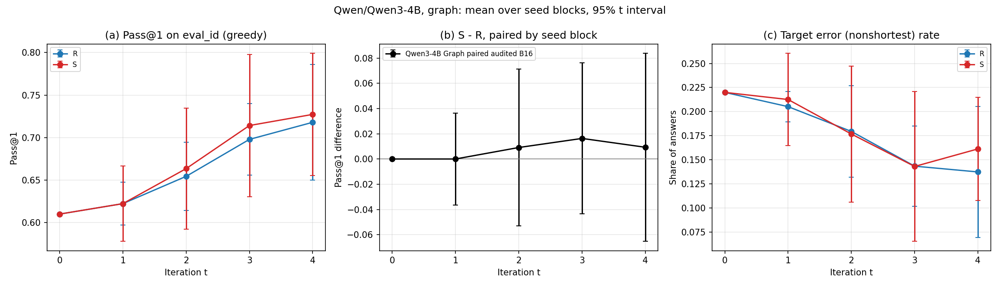
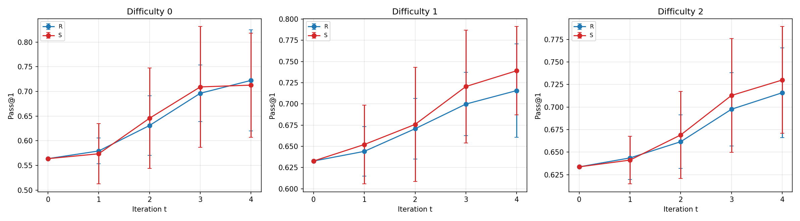
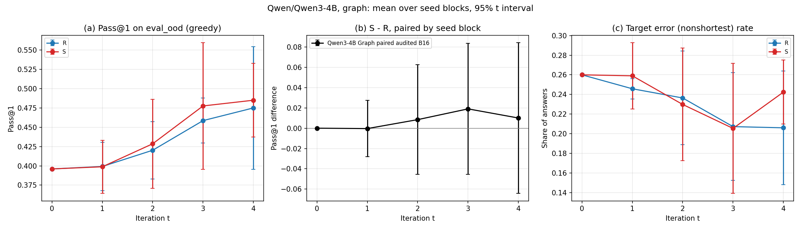
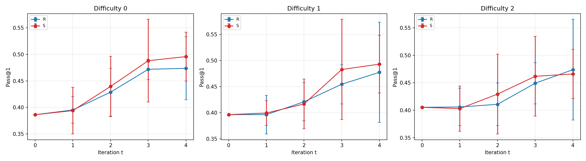

# Qwen3-4B Graph paired audited B16

Completed output snapshot collected on 2026-10-05 from a single batch job. The scheduler reports **COMPLETED**, exit **0:0**, with an
elapsed allocation time of **1 day 00:51:11**.

Training finished all **40 arm-rounds**: five seed blocks, two arms (R/S), four
rounds; both workers exited successfully. Greedy evaluation finished **41
checkpoints on each split** (one shared baseline plus 40 trained checkpoints):
`eval_id` has 2,000 questions and `eval_ood` has 1,000 questions. Plot generation
also finished.

## Plots and native summaries

These eight files are the cluster's original `plot_multiround.py` outputs,
copied byte-for-byte, not regenerated or edited for this snapshot.

| Split | Overall Pass@1, paired S−R, target-error plots | By difficulty | Native summaries |
|---|---|---|---|
| ID | [PNG](figures/figures_eval_id_pass1.png) | [PNG](figures/figures_eval_id_by_difficulty.png) | [JSON](figures/figures_eval_id_summary.json) / [CSV](figures/figures_eval_id_summary.csv) |
| OOD | [PNG](figures/figures_eval_ood_pass1.png) | [PNG](figures/figures_eval_ood_by_difficulty.png) | [JSON](figures/figures_eval_ood_summary.json) / [CSV](figures/figures_eval_ood_summary.csv) |

The summaries cover rounds 0–4, R/S and paired S−R, overall Pass@1 and target
error (`nonshortest`), and Pass@1 for difficulties 0–2. They preserve the native
means, standard deviations, 95% t-interval half-widths, and paired t-test
p-values. Each split's CSV has 75 data rows and agrees with its JSON. Round 0
is the same baseline checkpoint repeated across arms/blocks, not five
independently trained baselines. No new statistical interpretation is applied
in this snapshot.









## Provenance and protocol

- Source run: `/cluster2/RSI/runs/qwen3-4b-graph-paired-audit-b16-20261003-v01/`.
- Native repository commit: `f1fd1f8c7bf479a3ca8610240f68d204758d3391`.
- Model: `Qwen/Qwen3-4B`, revision `1cfa9a7208912126459214e8b04321603b3df60c`.
- Compute node: two A100-SXM4-80GB GPUs; independent R/S training workers.
- Inputs: frozen Qwen3-4B paired-inputs package from the original paired run (not included in this release).
  The five first-round pools (2,048 prompts × 8 answers each), shared initialization,
  and original reference tensors were reused; no replacement first-round pools or
  reference vectors were generated.
- Shared adapter parameter SHA-256: `81edfb8956d6f27b713dc9f5d33e40c750e355084104a8327af77428b35f47fe`.
- Auditing: adaptive B16, weighting enabled. Post-audit example counts may shrink;
  the pre-audit matching quotas were not forced after auditing.
- Evaluation: greedy Pass@1, initial batch size 32, maximum 2,048 new tokens.
  The evaluation log contains token-cap truncation warnings; native judgments and
  summaries are preserved without filtering those answers out.

The paired composite profile schedule is retained; this is not an all-new-profile run:

| Seed block | Round 1 | Round 2 | Round 3 | Round 4 |
|---|---|---|---|---|
| b00 | legacy | legacy | legacy | legacy |
| b01 | legacy | legacy | legacy | new |
| b02–b04 | new | new | new | new |

This is a four-round audited continuation snapshot, separate from the primary
one-step comparison in [2026-10-04-one-step](../2026-10-04-one-step/).
This addition changes no code, scientific configuration, or prior output snapshot.

## Full native output directory

The complete original [`out/`](out/) tree is included, with 934 files totaling
1,467,141,657 bytes. It contains the per-arm training and auditing records,
generated later-round pools, checkpoint adapters, matching and protocol records,
worker/coordinator status, and the ID/OOD evaluation answers and summaries.
The native files are copied unchanged from the source run above.

All relative file paths and contents were verified against the cluster using
SHA-256. The digest of the path-sorted per-file checksum records is
`9685b5efa3cdadcf4f9c46e8f9e3b6410160efedcad23dc9225275fc6eacb8aa`.
Each record is `<file SHA-256>  ./<relative path>\n`, sorted by UTF-8 path bytes.

The original first-round input pools, shared initialization, reference tensors,
and full execution logs outside `out/` remain on the cluster and are not part
of this directory upload. [SHA256SUMS](SHA256SUMS) records the source hashes for
the eight plots/summary files. Verify those from this directory with:

```bash
shasum -a 256 -c SHA256SUMS
```
